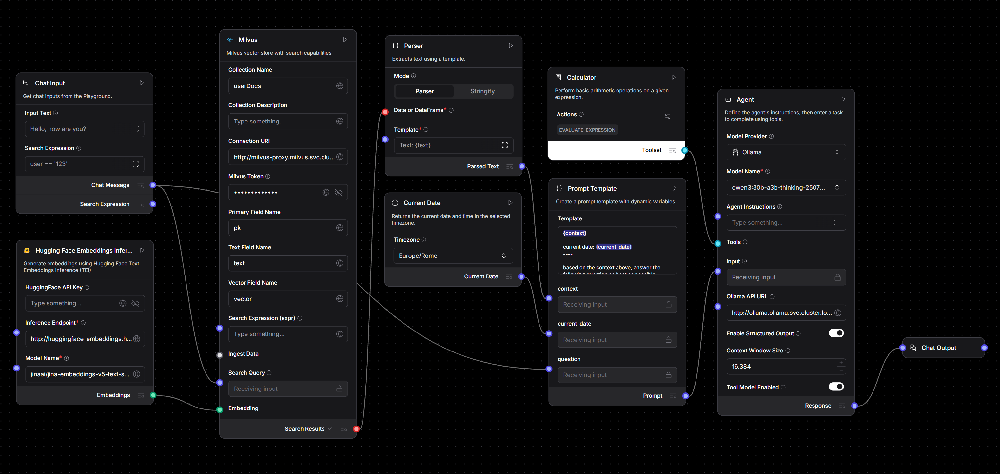

# AI Engine and Semantic Indexing 

This document covers the AI engine and semantic indexing of the Platform Zeta.

The objectives are to:

* Discuss possible technologies and approaches (LLM/LMM, traditional ML solutions, RAG, etc.).
* Propose an architectural schema consistent with the on-premise constraints.
* Provide a brief overview of the implementation and main flows.

## Technical Implementation

The application utilizes Langflow to design and orchestrate the Retrieval-Augmented Generation (RAG) and ingestion pipelines. This schematic describes how the different services interact. The selected software allows for a fully localized, containerized AI ecosystem that complies strictly with the fundamental constraint of the project: the solution must be designed as totally on-premise, without the use of external cloud providers or third-party AI services.

### Technologies and Approaches

To fulfill the requirement of semantic indexing and enabling user-agent interactions (chat), a **Retrieval-Augmented Generation (RAG)** approach is selected. Few other options land well to this specific use case while allowing for simple user interactions.

The technology stack is entirely self-hosted and open-source and relies on the following services:

* **LLM Engine:** vLLM, running locally on the Kubernetes cluster. The pipeline utilizes the `qwen3:14b-q4_K_M` model to power the agent's reasoning and conversational capabilities.
* **Embeddings:** Hugging Face Text Embeddings Inference (TEI) utilizing the `jina-embeddings-v5-text-small` model. This will leverage the same GPU accelerated kubernetes nodes as vLLM.
* **Vector Database:** Milvus, deployed as part of the kubernetes cluster (without GPU resources assignment), serves as the highly scalable vector store for document embeddings.

### Architectural Schema (On-Premise Constraints)

The architecture strictly adheres to the security and infrastructure constraints of the Aruba environment. All components (the LLM, the Embedding model, the Vector Database, and the orchestrator) reside as containerized microservices within the predefined Kubernetes cluster.

* Network traffic for AI processing never leaves the Aruba data center.
* Semantic isolation is achieved using metadata filtering at the database level (e.g., via the `search_expr` parameter in Milvus). This ensures strict data segregation, guaranteeing that a query only searches the documents belonging to that specific user among the ~2 million potentially integratable PEC mailboxes.

### Implementation and Main Flows

The system architecture supports two primary operational flows: Ingestion and Querying.

#### Document Ingestion Flow

When a customer activates semantic indexing for their documents:

1. The document text is extracted and chunked.
2. Text chunks are passed to the local HuggingFace TEI endpoint to generate high-dimensional vector embeddings.
3. These embeddings, along with essential metadata (such as the document ID and user ID), are stored in the Milvus `userDocs` collection.

#### Query / Chat Flow

This functionality is to be implemented based on the structure of the mock-up included below.

When a user interrogates their documents (both historicized and operational), the Langflow pipeline executes the following sequence:

1. **Input:** The `Chat Input` node captures the user's message alongside a dynamic search expression (`search_expr` like `user == '123'`) used to strictly filter database access.
2. **Vector Retrieval:** The user's query is embedded via the local HuggingFace embeddings node. This vector is sent to Milvus, which performs a similarity search against the user's specific indexed documents, retrieving the top matching results.
3. **Data Parsing:** A `Parser` node takes the raw output from Milvus and formats the extracted document chunks into a clean, readable text string.
4. **Prompt Construction:** The `Prompt Template` combines the retrieved document context, the user's original question, and the current date/time (fetched via a utility node configured for `Europe/Rome`).
5. **LLM Generation:** The constructed prompt is sent to the local vLLM `Agent` node. The LLM processes the context and formulates a grounded response. The agent is additionally equipped with a `Calculator` tool to perform arithmetic operations if the query requires it.
6. **Output:** The synthesized answer is returned to the user via the `Chat Output` node, completing the interaction loop.

The Current Date and Calculator nodes are added to the flow with the sole purpose of providing the LLM all information to make informed decisions and provide accurate answers.

### Underlying Architecture Requirements

Given the heavy reliance of the utilized software on the characteristics of the hardware it is installed upon, some considerations have to be given on some rough sizing of if.

#### Key Assumptions & Metrics

We will work under the following assumptions:

* **Total Platform Volume:** ~5,000,000 messages/day.
* **Target Adoption Rate:** 5% (resulting in 250,000 Chat requests and 250,000 Ingestion requests per day).
* **Hardware Unit:** NVIDIA RTX Pro 6000 (96GB VRAM).
* **Models:**
  * **Chat:** `qwen3:14b-q4_K_M` (~1,500 tokens/sec throughput).
  * **Embedding:** `jina-embeddings-v5-text-small` (~15,000 tokens/sec throughput per dedicated GPU with concurrent batching).

#### Estimated Daily Workload

| Feature | Daily Requests | Avg. Tokens/Req | Total Daily Tokens |
| :--- | :--- | :--- | :--- |
| **Chat (LLM)** | 250,000 | 500 (Gen) / 1000 (Ctx) | 125,000,000 (Gen) |
| **Ingestion** | 250,000 | 1000 | 250,000,000 |

#### Required GPU Infrastructure

To calculate the number of physical GPUs, we account for a **2.5x Peak Multiplier** to handle business-hour surges typical of enterprise PEC and document management services.

##### Chat Feature

* **Average Throughput Needed:** ~1,500 tokens/sec.
* **GPU Requirement (Baseline):** 1 GPUs.
* **GPU Requirement (Peak):** **3 GPUs**.

##### Document Ingestion

* **Average Throughput Needed:** ~3,000 tokens/sec.
* **GPU Requirement (Baseline):** 1 GPUs.
* **GPU Requirement (Peak):** **2 GPUs**.

### Safety and Data Isolation with Non-Deterministic AI Tools

When the semantic indexing of documents is activated , the platform leverages AI models and vector databases (such as Milvus) to allow users to interact with their documents via a chat agent. Because Generative AI and vector embeddings rely on non-deterministic retrieval methods, we cannot rely on the LLM itself to guarantee data isolation and prevent cross-user data leakage.

To ensure absolute user safety and strict tenant isolation, additional deterministic filters must be implemented at the Vector Database level:

* **Metadata Tagging:** When a document is processed by Hugging Face TEI and its embeddings are stored in Milvus, strict metadata tags (e.g., `user_id`, and `document_id`) are permanently bound to the vector payload.
* **Search Expressions:** During the Retrieval-Augmented Generation (RAG) process, when a user asks a question, the vector similarity search is not executed globally. Instead, the backend injects mandatory boolean search expressions into the Milvus query.
* **Execution:** The query takes the form of `similarity_search(query_vector) WHERE user_id == <authenticated_user_id>`. This ensures the vector database filters out all embeddings belonging to other users *before* performing the similarity ranking, ensuring that the AI agent only has access to the precise, authorized context of the querying user.
