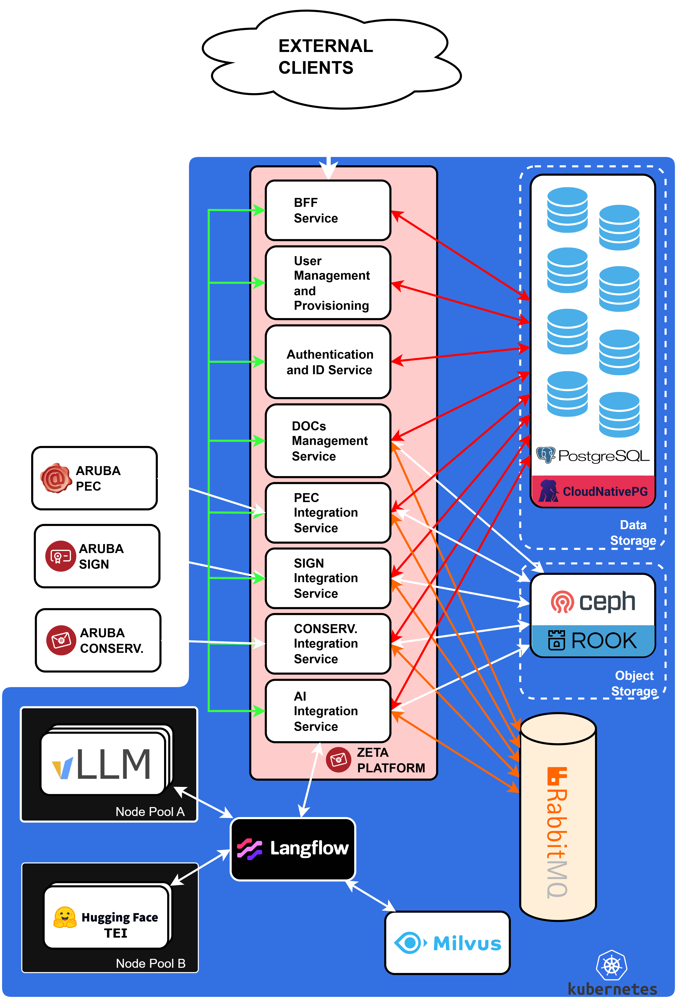

# Architectural Design 

This document covers the architectural design of the Platform Zeta.

## Requirements

When engineering the architecture of the platform it must be taken into account that:

* The platform will be accessible via web.
* Integration with Aruba systems (PEC, digital signature, digital preservation) will occur via REST APIs with OAuth2 compliant authentication.

The candidate must describe, using architectural diagrams and/or written documentation:

* The overall system architecture.
* The main application components.
* The interaction modes between microservices.
* The design choices deemed most appropriate to ensure scalability, reliability, and maintainability.

### Dimensional and Functional Constraints

The architectural design must consider the following constraints:

* **Number of integrable PEC mailboxes:** ~2 million.
* **Volume of managed messages:** over 5 million per day.
* **Volume of documents sent to preservation:** ~50 GB per day.
* **The user must be able to**:
  * Upload documents directly into the portal for quick subsequent actions (e.g., signature, PEC sending, preservation).
  * Use Aruba services even without document historicization.
  * Choose whether to activate the semantic indexing of documents. If activated, it must allow user-agent (chat) interactions to interrogate their documents, both historicized ones and those used only operationally.
* **Strictly On-Premise:** The solution must be designed as totally on-premise. The use of external cloud providers or third-party AI services is not permitted.

## System Architecture

The overall system Architecture is to be implemented based on the shown schematic. All of the services Within this application will be installed as kubernetes pods while providing the specific resources they require to function correctly.

  

The Zeta Platform consists of several core microservices and infrastructure components:

* **Zeta Platform Services:**

  * **BFF (Backend for Frontend) Service:** Acts as the main entry point for external clients.
  * **User Management and Provisioning:** Handles the creation and management of users.
  * **Authentication and ID Service:** Manages authentication and user token validation. It will be the only service to read and write the (encrypted) users access Tokens in its DB.
  * **DOCs Management Service:** Central service for document handling and historicization.
  * **Integration Services:** Dedicated microservices for PEC Integration, SIGN Integration, and CONSERVATION integration to connect with external Aruba systems via OAuth2 authenticated REST APIs.
  * **AI Integration Service:** Interfaces with the AI components to provide semantic indexing and chat capabilities.
* **Data and Object Storage:**
  * **PostgreSQL:** Relational database storage used by the microservices for structured data. This is installed through the CloudNativePG operator for simpler setup and management.
  * **Ceph & ROOK:** Object storage solution for securely historicizing user's documents.
* **Message Broker:**
  * **RabbitMQ:** Handles asynchronous communication and message queuing between services. The main purpose of this component is to provide a mean to queue requests that do not require strictly immediate responses. An example would be a request from a user to upload a file and submit it for ingestion to langflow. In this case the user would upload the file through the BFF with the DMS (DOCs Management Service). Once the file has been fully uploaded, the DMS can then notify the AI integration service that this file is ready to be vectorized, triggering the start of the data ingestion pipeline.
* **AI Engine Components:**
  * **Langflow:** Manages and orchestrates the AI workflows.
  * **Milvus:** Vector database used for storing semantic embeddings.
  * **Ollama (Node Pool A):** Runs on time-sliced GPU instances for local model execution.
  * **Hugging Face TEI (Node Pool B):** Runs on full GPU instances for Text Embeddings Inference.

### Interaction Modes Between Microservices

The communication between the different components utilizes a suite of different protocols depending on the type of communication link to be built between them:

* **gRPC (Green Lines):** Used for fast, internal synchronous communication between the BFF Service and the various backend microservices. In the schematic, for sake of minimizing clutter, it is shown as a Bus. In reality gRPC will provide a direct link between services with a fully connected topology.
* **REST (White Lines):** Used for external client connections to the BFF, API integration with external Aruba services (PEC, SIGN, CONSERVATION), and communication with AI workflow components like Langflow and Ollama.
* **SQL (Red Lines):** Represents the direct database connections from the backend microservices to their respective PostgreSQL database instances.
* **AMQP (Orange Lines):** Utilized for asynchronous messaging via RabbitMQ, allowing services like DOCs Management, CONSERVATION integration, and AI Integration to publish and consume events reliably.

### Kubernetes Autoscaling Strategy

To handle the constraints of managing over 5 million messages per day and 50 GB of daily preserved documents, the Kubernetes environment must leverage robust autoscaling:

* **Horizontal Pod Autoscaler (HPA):** Will be configured for stateless microservices (e.g., BFF, PEC Integration, and DOCs Management). HPA will automatically scale the number of pods up or down based on standard metrics like CPU and Memory utilization. Additionally, custom metrics from RabbitMQ (e.g., queue depth) will be utilized to asynchronously scale worker pods that process heavy document workloads.
* **Node Autoscaling & Resource Pools:** While the environment is strictly on-premise, the architecture relies on specific Node Pools (A for time-sliced GPUs, B for full GPUs) to ensure the AI components (Ollama, Hugging Face TEI) have the necessary hardware accelerators under high demand without starving general application pods.

### Storage infrastructure scalability

The storage softwares that are utilized in this application have all been selected as known industry standards with the ability to easily scale both vertically and horizontally. These intrinsic characteristics ensure that they can effectively scale as time progresses:

* **Milvus (Vector Database):** Milvus is designed with a cloud-native architecture that separates storage from computing. To handle a growing number of document embeddings, Milvus allows for sharding, where data is distributed across multiple nodes. As the vector index grows, new Query Nodes and Index Nodes can be added to the cluster to ensure low-latency searches.
* **Ceph with Rook (Object Storage):** By using Rook to orchestrate Ceph within Kubernetes, the object storage layer becomes software-defined. Scaling is achieved by simply adding new physical nodes with available disk space to the cluster. Rook automatically detects the new resources and triggers automated data redistribution (rebalancing) across the OSDs (Object Storage Daemons). This ensures that the 50 GB of daily incoming documents are distributed evenly, preventing any kind of imbalance and maintaining high throughput.
* **PostgreSQL on CloudNativePG (Relational Database):** For structured data and metadata, PostgreSQL is scaled using a Primary-Replica architecture (orchestrated via operators like CloudNativePG).
  * **Read Scalability:** As the number of concurrent users and PEC mailboxes increases, additional Read Replicas are deployed to offload query traffic from the primary instance.
  * **Write Scalability & Sharding:** For the massive volume of message metadata, Table Partitioning (by date or user ID range) is to be implemented. In extreme growth scenarios, Citus or similar extensions can be utilized to transform PostgreSQL into a distributed database, sharding tables across multiple nodes to handle high-frequency write operations.

### User Safety and Secure Token Storage

To properly satisfy the requirement to integrate Aruba services and securely historicize access keys and tokens within the microservices architecture, a centrally managed "Encryption at Rest" mechanism must be implemented. Considering that integration with Aruba systems requires OAuth2 compliant authentication, the following security posture will be adopted:

#### Service Responsibility (Authentication and ID Service)

The `Authentication and ID Service` microservice must be the *only* component authorized to read and write tokens in the PostgreSQL database. No other functional service (such as PEC Integration or CONSERVATION integration) will have direct access to the tables where these credentials reside.

#### Encryption at Rest in Spring Boot

OAuth2 tokens (Access Tokens and Refresh Tokens) must never be saved in plaintext within the database.

* **Algorithm:** A robust symmetric encryption algorithm (e.g., AES-256-GCM) will be utilized at the application level within the Spring Boot code.
* **Save Flow:** When a user links a service and the system obtains the OAuth2 token, the Spring Boot service encrypts it in memory and saves only the ciphered_text to the database.

#### Secure Key Management (Kubernetes Secrets)

To encrypt and decrypt tokens, the Spring Boot application requires a "Master Key". This key must never be hardcoded in the source code or in `application.yml` files.

* Because the system is orchestrated via Kubernetes, the Master Key will be stored as a Kubernetes Secret.
* This Secret is then mounted into the `Authentication and ID Service` Pod as an environment variable, allowing Spring Boot to access it securely at runtime.

#### Data Model (PostgreSQL)

Within the dedicated PostgreSQL database for the authentication service, the token table structure will be designed as follows:

* `id` (UUID)
* `user_id` (Reference to the owning user)
* `service_type` (Enum: PEC, SIGN, CONSERV)
* `encrypted_access_token` (ciphered_text)
* `encrypted_refresh_token` (ciphered_text)
* `token_expires_at` (Timestamp to manage automatic renewal)

#### Operational Flow Between Microservices

The components interact securely when an external service is invoked:

1. The `PEC Integration Service` receives an event (e.g., from RabbitMQ) instructing it to send a PEC message on behalf of a user.
2. Before making the REST API call to Aruba, the `PEC Integration Service` makes an internal synchronous request (via gRPC) to the `Authentication and ID Service` requesting the PEC token for that specific user.
3. The `Authentication and ID Service` reads the ciphered_text string from the PostgreSQL DB, uses the Kubernetes Secret key to decrypt it on-the-fly in memory, and returns the plaintext token to the calling service.
4. The `PEC Integration Service` injects the token into the authorization header (Bearer Token) of the REST call to the external Aruba system.
5. Once the call is complete, the plaintext token is eliminated from memory (garbage collection), guaranteeing separation of concerns and rigorous secure historicization.
